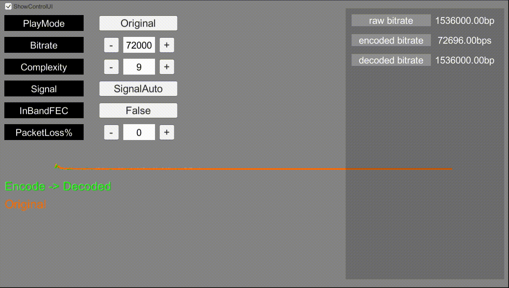

# Caress.Unity - encoder / decoder / noise reducer

## What is Caress.Unity?    
Caress.Unity is a wrapper library for libopus and librnnoise. The libopus can handle encoding / decoding audio frames. The librnnnoise can handle noise reducing. Caress.Unity can encoding, decoding, and noise reducing with Unity(C#). Actually, Caress.unity is a wrapper for [caress](https://github.com/tkmn0/caress), so caress is a wrapper library for c libraries and Caress.Unity is a wrapper library for golang.    

## Features
- Audio encoding with opus codec.
- Audio decoding with opus codec.
- Noise reduction with RNNoise.

## Supported Platforms
- Windows x86_64
- OSX x86_64

## Installation
1. __UPM Package__    
You can add `https://github.com/tkmn0/Caress.Unity?path=Assets/Caress` to Package Manager.    
or add `"com.nzer0.caress": "https://github.com/tkmn0/Caress.Unity?path=Assets/Caress"` to Packages/manifest.json.

2. __Unitypackage__    
You can download Caress.unitypackage from Releases.

## Examples
Check [Examples](./Assets/Caress/_Examples).

## Dependencies
- libopus 1.3.1
- librnnoise-nu 

## Special thanks to
- [opus](https://github.com/xiph/opus) 
- [rnnoise-nu](https://github.com/GregorR/rnnoise-nu)
- [rnnoise](https://jmvalin.ca/demo/rnnoise/)

## License
Caress.Unity is under MIT License.